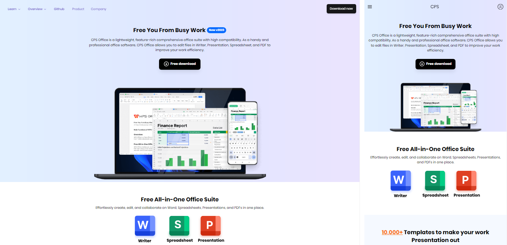

# CPS



**Disclaimer**: This is a simplified clone of the [WPS website](https://www.wps.com), a pet project of the author. All rights reserved.

Now pretend the following is a real sales pitch by a marketing representative of an imaginary software startup.

"Creative Productive Software (CPS) is a powerful suite of document editors including popular formats such as .docx, .pdf, .pptx .etc and a host of other functions &amp; formats."

## Setup

This is a project bootstrapped with Vite+React. View the live version [here](https://www.ben-dev10.github.io/cps/).

Use the following command to install all dependencies:

```bash
npm i
```

To start the dev server:

```bash
npm run dev
```

I prepared [some notes](./docs/general.md) along the way.

Libraries used:

- Radix Primitives
- TailwindCSS

## Principles

1. Mobile First
2. 'Function' before 'form'
